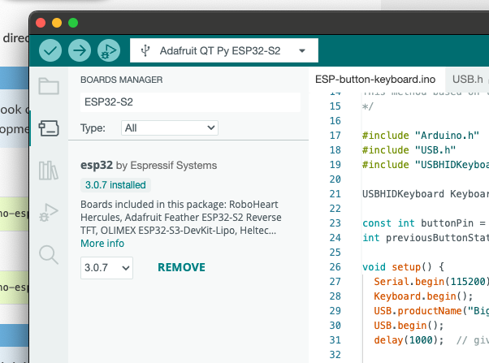
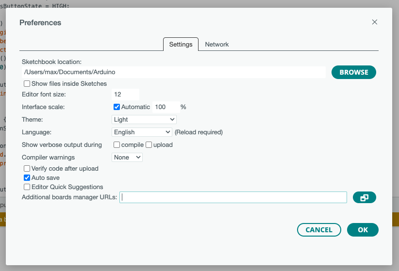

# Big Red Button

1. Introduction
2. Getting started
3. Hardware description
4. Dev env setup
5. Features and capabilities
6. Copyright, license and legal

## Introduction

This is the Big Red Button™. It's a novelty single purpose keyboard with easily customizable logic and an IP67 rating.

It's loud and obnoxious, but it's very good at sending one predetermined keystroke. Use it at the office to piss off your colleagues, include it in some kind of gaming rig for an immersive experience, or imagine any kind of use case. The sky is the limit.

## Getting started

The button is pre-programmed to behave like a standard USB keyboard. Plug it in, follow the dialog about keyboard layout (won't matter which you choose since it's only one key) and start pressing. It has been tested to work on Linux, macOS, Android and iOS out of the box with no additional configuration.

## Hardware description

The button contains industrial-grade switching elements, one of which is connected to an ESP32-S2 board, which in turn is driven by your device via the USB cable. The ESP chip is capable of being programmed while the device is acting like a keyboard, so reprogramming does not require opening the box.

There are two switching elements included, one Normal-Open, and one Normal-Closed. The circuit is connecting the `RX` pin on the board to `GND` via the Noraml-Open switch, which means that the connection is made when you press the button. The `RX` pin is pulled high when not connected, so reading the pin "HIGH" means that the button is not pressed, and "LOW" means the button is pressed.

The microcontroller is an ESP32-S2 chip, and it's housed on an [Adafruit QT Py dev board](https://learn.adafruit.com/adafruit-qt-py-esp32-s2). It is capable of USB HID emulation (keyboard, mouse, joystick...), Wifi connectivity, and has a very flexible GPIO setup with DAC and ADC capabilities on many pins.

## Dev env setup

There are a couple of options for development, I'm going to describe the Arduino IDE approach.

- Download and install [Arduino IDE](https://www.arduino.cc/en/software)
- Open the application and go to the Boards Manager in the left-hand toolbar (fig. 1)
- Search/filter for ESP32, find esp32 by Espressif Systems
  - If you can't find it:
  - Open the Arduino IDE Preferences (fig. 2)
  - In the settings tab, find "Additional boards manager URLs" at the bottom
  - Enter the URL `https://espressif.github.io/arduino-esp32/package_esp32_index.json`
  - Confirm by clicking OK and perform the search again
- Install the board
- Connect the button via USB
- Find and select the appropriate board connection in the dropdown at the top of your IDE window (fig. 1)
  - Should be named "Adafruit QT Py ESP32-S2", usually connects as a `cu.usbmodem` serial port
- Load the project file from this repo, use the Arrow button next to the board connection selector to upload the code to the board
- Additional libraries like the Keyboard and USB libs may have to be installed if prompted.

Figure 1

Figure 2

## Features and capabilities

The ESP32-S2 board is capable of Wifi connectivity, but not Bluetooth. Possible use cases can extend to firing a web request when the button is pressed. The board also has features like PWM, analog sensing, touch sensing, onboard RGB LED and additional communication ports, but in its button enclosure, most features are unavailable.

The button sensing code is currently debounced with a 50ms detection span, thanks to the setup/loop style of runtime. This means that instead of getting an event triggered on every change of the button state (high to low or low to high), the code is instead running on an infinite loop with a 50ms interval. If a press down change is detected in such a window, the keyboard keystroke is sent.

If you happen to be faster than 50ms, the keypress may not register. Detection is only made on the change from high to low, so no additional keystrokes will be sent if the button is held down.

---

Made by Max Witt 2024
